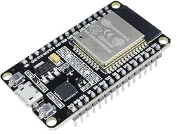
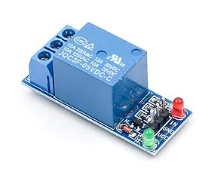
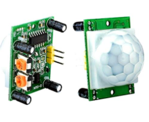
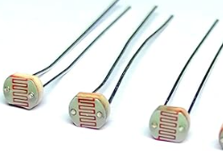

# Iot Based Energy Management
- [Introduction](#introduction)
- [Tasks](#tasks)
- [Block Diagram](#block%20diagram)
- [Working](#working)
- [Programming](#programming)


---

#### Todo
- [ ] [[Energy Monitoring]] 
- [ ] [[Solar Tracking]]
- [ ] [[Energy Management]]

#### Future Tasks
- [ ] [[Monitoring Server]]

---

#Componets_Required 

1. [[ESP32]]  [Amazon.in](https://www.amazon.in/SquadPixel-ESP-32-Bluetooth-Development-Board/dp/B071XP56LM/ref=sr_1_2?crid=24JW0OZEXKTIL&dib=eyJ2IjoiMSJ9.UQEwVBzfimFjcDfwrwQdQewlHZnwjR6ZwoBzCkjwAwr9QIGFosQC6ZHokXaGePxvR2NkB1ArKzgPrkF2_MUZfeTJgz0yS4ZSkq8GpylKAB6pITqoAISR09LJ_UPNDKTFeMYTE7rxTUvCoAlx_6XLHbvklLsmlOjD8drzN8AximjCTeE8bQ8l3lD0Br3wTfHZXeZJhY5zS_u0KVOZwGmXHG9WbHQbewO1tWuBnZf27aA.vnUxjUCaXjdMe1GQJfwNgHTVBIib_HACEK7cmaiAP88&dib_tag=se&keywords=esp+32&qid=1709177048&sprefix=esp+%2Caps%2C272&sr=8-2)
2. [Relay Module](#relay%20module) [Amazon.in](https://www.amazon.in/Generic-Unbranded-4-Channel-Control-Optocoupler/dp/B00C59RNPE/ref=sr_1_3?crid=2AYE5U21I3V4P&dib=eyJ2IjoiMSJ9.ID68x7LNTLRKW3X-sr0rb6ye2GKu-Bv-NF8LWsJzDsjCIZNqkizrBpohD1pn8xK8ks805CMHGwjlc4tbAzhi04SC8ZqZNRnwq0kRfsELS0fkRJ4HtyVjIYKtg_srTCvies8nbS7shNUhqLVfcrKoCqa_6UdbWVEm7loBTGePd38OsD9by1ZZmLo-j6mO-kMs0xg5eSip6Bx4_AY6LIioTVnhaDC3LQrD5UX2EtmILfKKc8qG5yXrzg5vL4MohimJe_fIVWBS227AweL6nBz8iF4hDgjA-cJxLRtvSznfYO4.K5IkhT0Ja9tReMuG17BqjWIcRduskzIcu11Y14jErq4&dib_tag=se&keywords=relay+module+for+arduino&qid=1709146007&sprefix=relay+module+for+a%2Caps%2C407&sr=8-3)
3. [PIR Sensor](#pir%20sensor)   [Amazon.in](https://www.amazon.in/Generic-HC-SR501-Sensor-Pyroelectric-Infrared/dp/B00VNWWZM0/ref=sr_1_2?crid=1JWJ3DZBVIBLP&dib=eyJ2IjoiMSJ9.VYMBX3ndDUq5ly4VjJnIe19JWw7yOkW_CzhDez4QZ0EGHIm5SLpl0OoO78gDDXWC8NfoVBMN-fS7UeG9BckXaDlABuZcxshU6CKbg88sfyLVHJH9_JOD6tScGAlfoV5iSKLdolbzLR3dukxh_sp-0OSF-v3VXqdMN-4V7ejFqMcYJ4pDD017hjD5nhDDj9KRLZv_RseGh_MEo5wNYByVRlkZHdb8gQV3QRQQH8CUZA5OsgwM6POaUW0oLGR_VLajXkMAgI8S9dDWe9c2O2sk74Qrlvld9J8vd39uLhNIkfY.zAIqfcY5gh59JnxKJEUBSLNxRvnJEFG9RMwOoZTrQhY&dib_tag=se&keywords=pir+sensor+for+arduino&qid=1709176792&sprefix=pir+sensor+for+arduino%2Caps%2C257&sr=8-2)
4. [LDR Sensor](#ldr%20sensor) [Amazon.in](https://www.amazon.in/UNIVERSAL-Genuine-Dependent-Resistor-Photoresistor/dp/B0BT7ZH6HP/ref=sr_1_5?crid=34OXJF7F75GF0&dib=eyJ2IjoiMSJ9.ClKoVIMK1jtRL2PJvVx-T3d1HrtmI-X5l6wWGYa7siELcYHDsWYp6qXdqqapLlpg9PWydoRs3zwrPS361t83EA4eEMvUdErAwWjM_kt7SeYAIfp-7Sw-jhyCQdGjCW_UMfepiYWz4uqxvJ-lRlmM0zmo59l-g6cxC_94YAd8gKS0fhIECEEEkJcJc49pb-3GfoWs6tm-MtD7QisOo65Lth0e8Wz1w_br38Zpcd2jC9e5O38XV3w63dZj_dS7hqcO1VFkWtJy79ZYNJG0xTSuyHf2BR_20Nj28E5yFya07d4.xXhXSPwrxk86ohZ6KPghYqp-zZmS3XBeXBmqAN6Fi_I&dib_tag=se&keywords=ldr+sensor&qid=1709184635&sprefix=ldr+sensor%2Caps%2C313&sr=8-5)
6. [Servo Motor](https://www.amazon.in/RIDEN-Geared-Helicopter-Airplane-Controls/dp/B0CN131QPQ/ref=sr_1_11?content-id=amzn1.sym.5e455782-2b09-4126-83e3-a9dbac6d07bb%3Aamzn1.sym.5e455782-2b09-4126-83e3-a9dbac6d07bb&dib=eyJ2IjoiMSJ9.MqqJvQWdDwE3ruyo0REGE20Qv0WJIsJN8vc8juV2uWJD6jE4SQ8WJ5f662-9jYyGM5IWrBbJCw2OoKWs4Ky0cE2Ho7cUSN_k1eXerwzz9-Za_c0UI4UuJfeMHe8QL7_n6UcddGr8zA3SwIYSGPRy47rf1mELRy0-Ss_v8kpcfPlxCyg8yZSCzkclM4QpVYXbFT6P5Fe3T-WAAF-Th52GhzfUaTxnrPzeUnSNtjvPv54vpAaP5uU-e9944YbGb1G3f1_OkcIZG3iFGLryXt4GJHQyYc8lBWeH-K51rJuPRj0.-8lDJQposaQyV19f2twMh1wFpuGEP92xBFH9Y8YSIHk&dib_tag=se&keywords=servo+motor+for+arduino&pd_rd_r=52569d34-155b-472c-aec5-080918b88852&pd_rd_w=Si9ox&pd_rd_wg=G41bB&pf_rd_p=5e455782-2b09-4126-83e3-a9dbac6d07bb&pf_rd_r=55CJ6X8NJYYVA6RPZ6YV&qid=1709184353&sr=8-11)
7. [Solar Panel](#solar%20panel) [Amazon.in](https://www.amazon.in/Electronic-Spices-Rectangle-Polycrystalline-Alligator/dp/B0BPC3B697/ref=sr_1_2?crid=QDW2PA72QRYL&dib=eyJ2IjoiMSJ9.oS9RWt8EoBiSueBB7EXI0idJCB5fU7ffexptuMuA91umwIFOtC7Zu2wPDcUu4-IARyR683t-UBQ0ooAI7Fev9TzivxbmdBoPlgQsJsKIBTxrYk9YlFYjlTwVwiD_e3YlKJ-iz8T3mTphQHTtjTZ6yxLGyKrUlosySp4lFd2iLhSnUu4NJVKh2E2sMrPgeDGEm0LohQgurUEErVdnKBotAUZMH8LWG51v7lt4emkgTGkKERpRiws1Pg8_Uoyjwjwxhw2SUbRK3v_GY27S_FQEd9z8QjlYvG13_umVl6N2Wv0.WNu7HrA49EtTmgyl-A-TUY1v_ewnFzo-BqQt1S37PAc&dib_tag=se&keywords=solar+panel&qid=1709188151&refinements=p_36%3A-50000&rnid=1318502031&sprefix=solar+panne%2Caps%2C398&sr=8-2)

---
#### Block Diagram

![[project_block_diagram.png|600]]

---

#Components_Rate

| Components               | Rate        | Quantity |
| ------------------------ | ----------- | -------- |
| ESP32                    | 579 Rs      | 1        |
| PIR Sensor               | 149 Rs      | 1        |
| LDR Sensor               | 50 Rs       | 2        |
| Servo Motor              | 125 Rs      | 2        |
| Solar Panel              | 250 Rs      | 1        |
| **Total Estimated Cost** | **2400 Rs** | -        |

---

#Components_Details
- [ESP32](#esp32)
- [Relay Module](#relay%20module)
- [PIR Sensor](#pir%20sensor)
-  [LDR Sensor](#ldr%20sensor)
##### ESP32
- [Pinout](#esp32%20pinout)
- [Specs](#esp32%20Specs)

##### Introduction
ESP32 is a series of low-cost, l==ow-power system on a chip microcontrollers== with integrated ==Wi-Fi== and dual-mode ==Bluetooth==




###### Esp32 Pinout


![[esp32_pinout.png|600]]

##### Esp32 Specs

- Single or Dual-Core ==32-bit== LX6 Microprocessor with clock frequency up to ==240 MHz==.
- 520 KB of SRAM, 448 KB of ROM and 16 KB of RTC SRAM.
- Supports 802.11 b/g/n Wi-Fi connectivity with speeds up to 150 Mbps.
- Support for both Classic Bluetooth v4.2 and ==BLE== specifications.
- ==34== Programmable GPIOs.
- Up to 18 channels of ==12-bit SAR ADC== and 2 channels of ==8-bit DAC==
- Serial Connectivity include 4 x ==SPI==, 2 x ==I2C==, 2 x ==I2S==, 3 x ==UART==.
- Ethernet MAC for physical LAN Communication (requires external PHY).
- 1 Host controller for SD/SDIO/MMC and 1 Slave controller for SDIO/SPI.
- Motor PWM and up to 16-channels of LED PWM.
- Secure Boot and Flash Encryption.
- Cryptographic Hardware Acceleration for AES, Hash (SHA-2), RSA, ECC and RNG

---
##### Relay Module



Relays are electro-mechanical switches that are used to control the flow of electricity in a circuit.
- Relay Module provides `isolation` between ==Signal== and ==Load== 


---
##### PIR Sensor

- PIR sensors ==detect changes in infrared radiation== within their field of view, which occur when a person enters or moves within the sensor's detection range
- PIR (passive infrared) sensors utilise the detection of infrared that is radiated from all objects that emit heat. This type of emission is not visible to the human eye, but sensors that operate using infrared wavelengths can detect such activity.


---

##### LDR Sensor




![[ldr_sensor.png|300x200]]
- Changes resistance according to how much lights hits them
```bash
if Light == Low
	Resistance = High
```


---

##### Solar Panel


*A solar panel is a device that converts sunlight into electricity by using photovoltaic cells. PV cells are made of materials that produce excited electrons when exposed to light*


---
